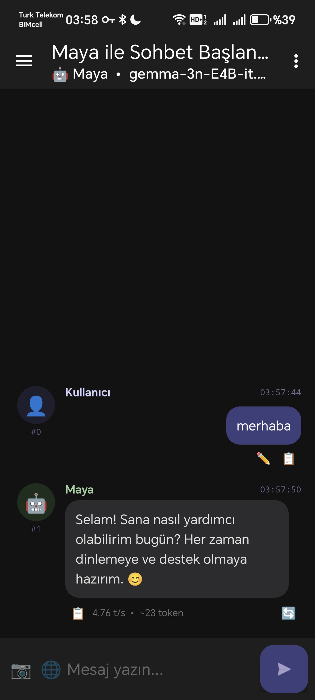
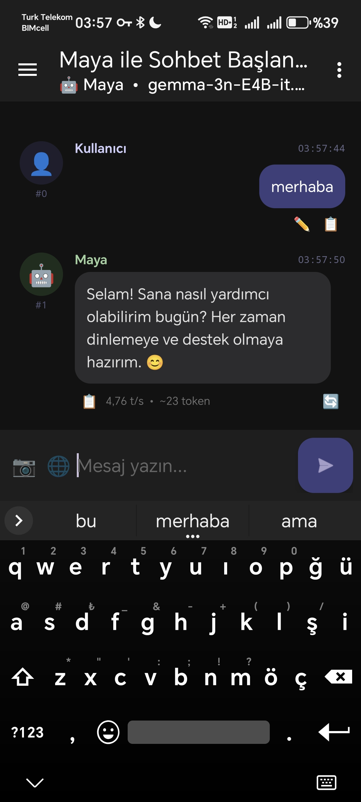
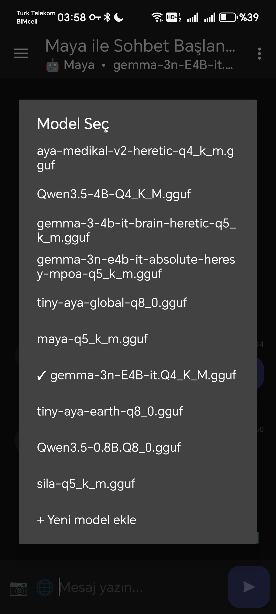
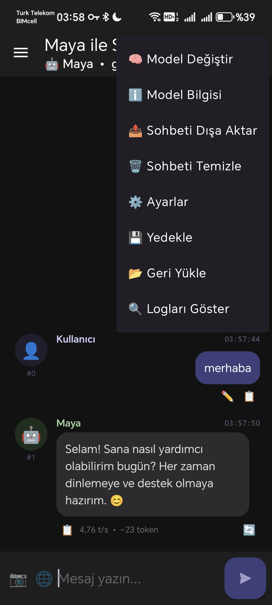
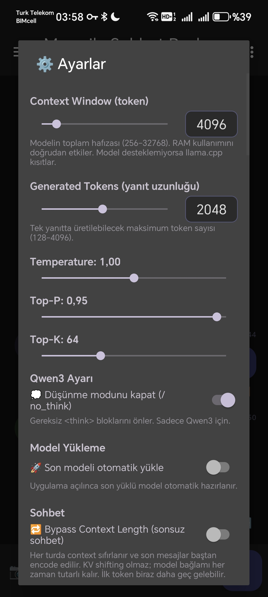
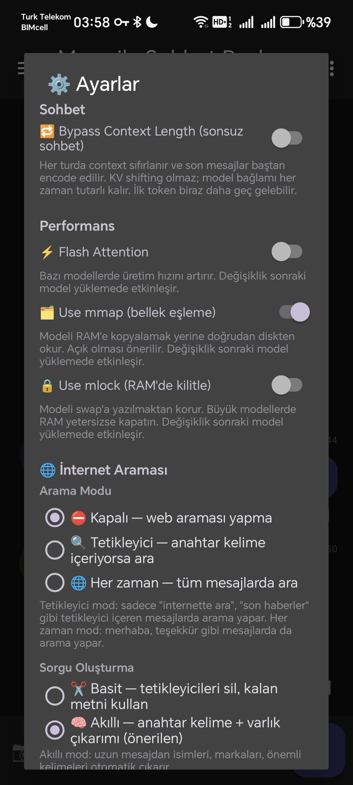
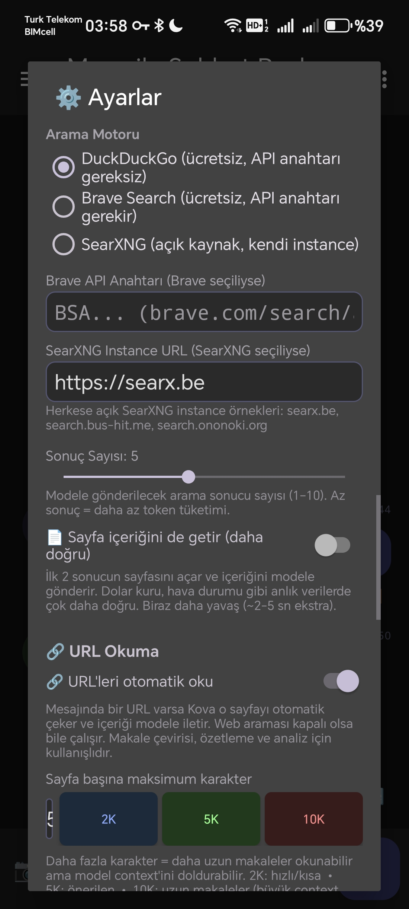
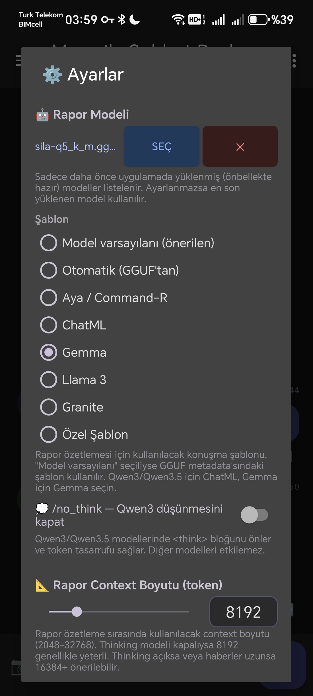
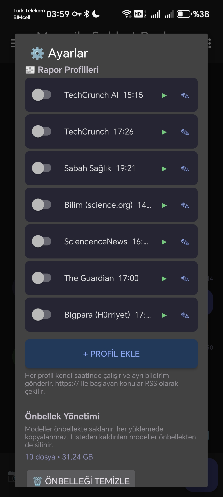
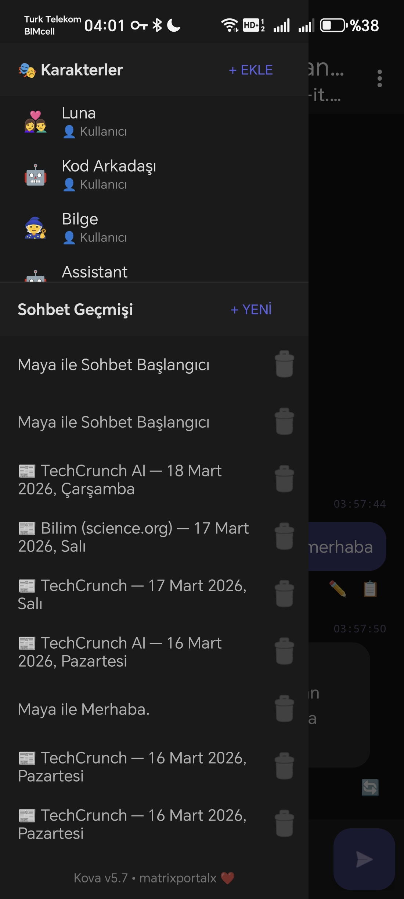

# 🪣 Maya

**Maya**, Android cihazlar için tamamen çevrimdışı çalışan, llama.cpp tabanlı bir yerel LLM sohbet uygulamasıdır. Hiçbir bulut bağlantısı, sunucu veya veri paylaşımı yoktur. Model, doğrudan telefonunuzun işlemcisinde çalışır.

> 🌐 Uygulama arayüzü Türkçedir.

---

## 📸 Ekran Görüntüleri























---

## ✨ Özellikler

### 🤖 Model Yönetimi
- GGUF formatındaki modelleri yerel depolamadan yükle
- Birden fazla model ekle, listeden seç, kaldır
- mmap / mlock desteği (RAM kullanım kontrolü)
- Flash Attention desteği
- Son modeli otomatik yükleme

### 💬 Sohbet
- Çoklu bağımsız sohbet geçmişi (Room DB)
- Otomatik sohbet başlığı üretimi
- Markdown render (Markwon)
- Kod bloğu kopyalama
- Bypass Context Length — KV cache sıfırlama ile teorik olarak sonsuz sohbet
- Qwen3 / Qwen3.5 `/no_think` desteği

### 🎭 Karakter Sistemi
- Özel karakter profilleri: emoji, karakter adı, kullanıcı adı, sistem promptu
- `{{char}}` / `{{user}}` yer tutucu desteği
- `{{date}}` / `{{time}}` dinamik sistem promptu ekleme

### 🌐 İnternet Araması
- DuckDuckGo (gizlilik odaklı)
- Brave Search API
- SearXNG (öz barındırmalı)
- Sayfa içeriği otomatik okuma (URL fetch)
- Mesajdaki URL'leri otomatik algılama ve okuma

### 📋 Günlük Rapor
- AlarmManager ile zamanlı arka plan özeti (Doze-dayanıklı)
- RSS besleme + web arama konu desteği
- Birden fazla rapor profili
- Ayrı "Rapor Modeli" ayarı (büyük modelden bağımsız, küçük model seçimi)
- Bildirim → sohbete ekle akışı

### 📝 Sohbet Şablonları
- Otomatik (GGUF Jinja metadata'sından)
- Aya / Command-R, ChatML, Gemma, Llama 3, Granite
- Tam özel şablon CRUD (UUID tabanlı, kaydetme/düzenleme/silme)

### 💾 Yedekleme & Geri Yükleme
- Sohbetler ve/veya ayarları ayrı ayrı yedekle
- Şifreli (AES-256 GCM) veya şifresiz JSON
- Karakterler, rapor profilleri, şablonlar yedeklemeye dahil

---

## 📦 Kurulum / APK İndirme

Hazır APK dosyasını [Releases](../../releases) bölümünden indirebilirsiniz.

**Gereksinimler:**
- Android 13+ (API 33)
- arm64-v8a işlemci (Snapdragon, Dimensity vb.)
- Önerilen: 8 GB+ RAM

**Model nereden bulunur?**
[Hugging Face](https://huggingface.co/models?library=gguf) üzerinde GGUF formatında yüzlerce model mevcuttur. 1B–8B arası modeller çoğu telefonda çalışır.

---

## 🧩 Desteklenen Modeller

| Model Ailesi | Durum |
|---|---|
| Qwen3 / Qwen3.5 | ✅ Çalışıyor (`/no_think` destekli) |
| Gemma 3n (resmi) | ✅ Çalışıyor |
| Llama 3 | ✅ Çalışıyor |
| Tiny Aya / Aya | ✅ Çalışıyor |
| IBM Granite | ✅ Çalışıyor |
| LFM (Liquid) | ✅ Çalışıyor |
| Gemma 3n (heretic/topluluk) | ⚠️ Kararsız |
| Görsel tanıma (vision/mmproj) | 🔄 Altyapı mevcut, geliştirme devam ediyor |

Genel kural: llama.cpp'nin desteklediği tüm GGUF modeller çalışır.

---

## 🏗️ Mimari & Teknik Detaylar

```
kova/
  app/          → Android Kotlin katmanı
  lib/          → JNI köprüsü (Kotlin + C++)
  llama.cpp/    → Motor (git submodule)
```

| Katman | Teknoloji |
|---|---|
| UI | Kotlin, Android Views, Material3 |
| Çıkarım motoru | llama.cpp (C++) |
| JNI köprüsü | ai_chat.cpp + InferenceEngineImpl.kt |
| Veritabanı | Room (sohbet geçmişi) |
| Arka plan görevleri | WorkManager + AlarmManager |
| Multimodal altyapı | mtmd.h (tools/mtmd) |
| Build | GitHub Actions, Android NDK (arm64-v8a + x86_64) |

**Kod Mimarisi:** ~4100 satır Kotlin, 10 dosyaya bölünmüş extension function sistemi.

---

## 📄 Lisans

Bu proje [llama.cpp](https://github.com/ggerganov/llama.cpp) üzerine inşa edilmiştir (MIT lisansı).

---

*Maya v1.0.0 • matrixportalx*
